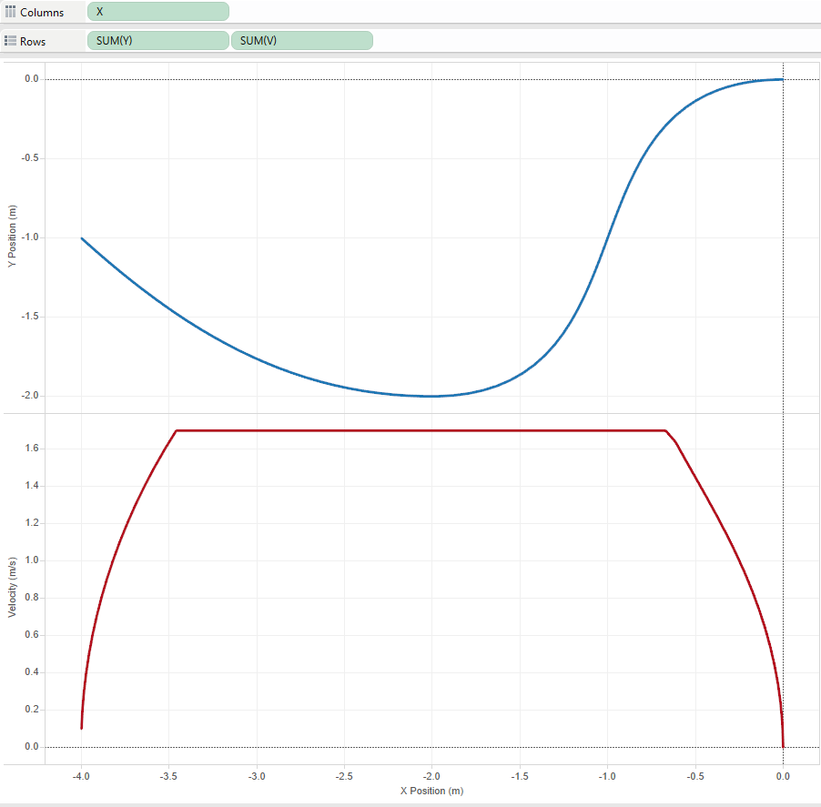

# Pathfinder
Cross-Platform, Multi-Use Motion Profiling and Trajectory Generation.

Pathfinder is a library for generating Motion Profiles, a way to smoothly fit and follow a trajectory based upon 
given waypoints. Currently, both a C and Java API are available, but can be applied to almost any application.

An example profile is given below, with the waypoints:  
1) X = -4, Y = -1, Angle = -45 degrees  
2) X = -2, Y = -2, Angle = 0  
3) X = 0,  Y = 0,  Angle = 0

The Graph on top is the X/Y position, and the Graph on the bottom is the Velocity.  


## Modifiers
Pathfinder supports Modifiers. Modifiers are a way to manipulate a trajectory with a given rule.  
Pathfinder supports Tank and Swerve Drive modifiers.  

Tank Drive:  


Swerve Drive:  


## Building
To build the project, run the following command:
```
./gradlew build
./gradlew assemble
```

To build the C code only:
```
./gradlew :Pathfinder-Core:build
```

To build the Java code:
```
./gradlew :Pathfinder-Java:build
./gradlew :Pathfinder-Java:assemble
```

This will build for both the x64 and x86 architecture for your platform. To cross compile for ARM, do the following:
```
./gradlew build -Parm -PcompilerPrefix=arm-linux-gnueabi
./gradlew assemble
```